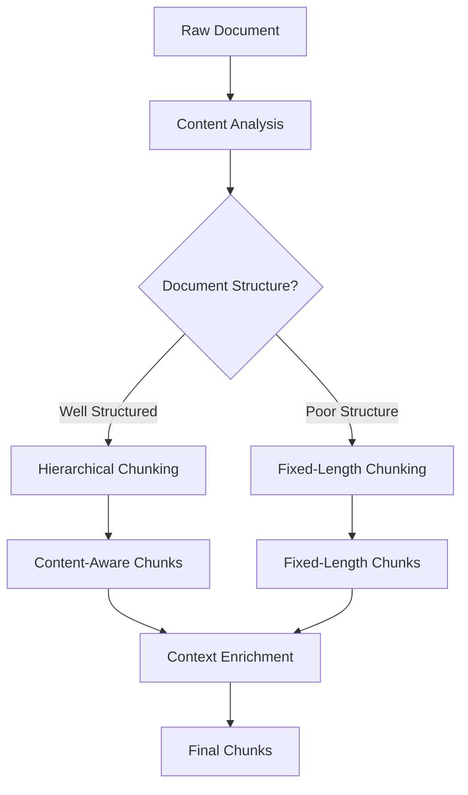

# Content-Aware Chunking

*An intelligent document chunking library for RAG systems with automatic fallback.*

## The Vision

This repository will house a production-ready chunking library designed to transform raw documents into context-aware chunks for RAG systems. The goal is to create a library that automatically chooses the best chunking strategy based on document structure, ensuring optimal quality for retrieval.

## The Problem

Traditional document chunking for RAG systems often breaks sentences, destroys context, and creates poor-quality embeddings. Most chunking strategies use simple fixed-length splitting that ignores document structure, leading to context fragmentation and inconsistent chunk quality.

## Project Goals & Key Features

This library is being built to address these challenges. The key features will include:

- **🧠 Smart Method Selection**: Automatically choose between hierarchical and fixed-length chunking.
- **🎯 High-Fidelity Chunking**: Preserve semantic boundaries by respecting headings, paragraphs, and sentences.
- **🔄 Intelligent Fallback**: Automatically revert to a fallback strategy for unstructured documents.
- **📝 Context Enrichment**: Add document title and section context to each chunk.
- **⚡ Zero Dependencies**: The core functionality will have no external dependencies.
- **🔧 TypeScript First**: A clean, fully-typed API for a great developer experience.

## Development Roadmap

This project will be developed through 3 focused commits:

1. **Foundation Setup** ✅ (Current)
   - Project structure and basic configuration
   - TypeScript setup and build pipeline
   - Basic documentation and examples

2. **Add Production Implementation** 📋
   - Integrate the complete, battle-tested Supabase Edge Function as a baseline
   - Real-world production code (1,099 lines)
   - Comprehensive error handling and queue integration

3. **Extract Core Library** 📋
   - Refactor the production logic into a dependency-free, reusable module
   - Complete API documentation and comprehensive testing
   - Examples and integration guides

## Architecture Preview

The planned architecture will intelligently route documents to the optimal chunking strategy:



## Getting Started (When Ready)

Once the library is built, you'll be able to:

```bash
# Install the package
npm install content-aware-chunking

# Use in your code
import { chunkText } from 'content-aware-chunking';
const chunks = chunkText(document, 1000, 80);
```

## License

MIT License - see [LICENSE](LICENSE) file for details.

---

*This library is being developed from production-tested logic that has processed thousands of documents in a real-world RAG system.*