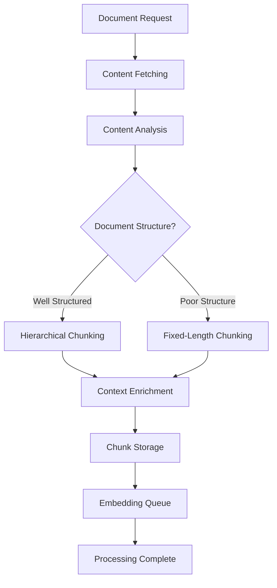

# Content-Aware Chunking: Production Implementation

*Complete, production-ready Supabase Edge Function with intelligent document chunking*

[](https://www.typescriptlang.org/)
[](https://supabase.com/)

## 🎯 **What This Is**

This commit contains the complete, unmodified production Supabase Edge Function that implements intelligent document chunking for RAG systems. This is the actual code that processes documents in a real-world environment.

## 🚀 **The Production Function**

The `process-document-for-rag` Edge Function is a comprehensive document processing system that:

- **Fetches Content**: Retrieves documents from various sources (PDFs, market reports, etc.)
- **Intelligent Chunking**: Automatically chooses between hierarchical and fixed-length chunking
- **Context Enrichment**: Adds document titles and section context to chunks
- **Queue Integration**: Integrates with embedding generation queues
- **Error Handling**: Comprehensive error handling and status tracking
- **Resume Capability**: Supports resuming interrupted processing

## 🏗️ **Architecture Overview**



## 📋 **What is Supabase?**

Supabase is a backend-as-a-service platform that provides:

- **PostgreSQL Database**: Full-featured database with real-time subscriptions
- **Edge Functions**: Serverless functions (like AWS Lambda) running on Deno
- **Authentication**: Built-in user management and security
- **Free Tier**: Perfect for development and testing

**Why This Matters**: The chunking function runs as a Supabase Edge Function, making it easy to deploy and scale without managing servers.

## 🛠️ **Getting Started**

### **Prerequisites**

- **Supabase Account**: Free account at [supabase.com](https://supabase.com)
- **Supabase CLI**: For local development
- **Node.js**: Version 18+ for local testing

### **Deployment**

1. **Create Supabase Project**:
   ```bash
   # Install Supabase CLI
   npm install -g supabase
   
   # Login to Supabase
   supabase login
   
   # Create new project
   supabase projects create my-chunking-project
   ```

2. **Deploy the Function**:
   ```bash
   # Deploy the Edge Function
   supabase functions deploy process-document-for-rag
   ```

3. **Test the Function**:
   ```bash
   # Test with sample data
   curl -X POST 'https://your-project.supabase.co/functions/v1/process-document-for-rag' \
     -H 'Authorization: Bearer YOUR_ANON_KEY' \
     -H 'Content-Type: application/json' \
     -d '{"source_type": "pdf", "source_id": "your-document-id", "user_id": "user-123"}'
   ```

## 📚 **Documentation**

- [**API Reference**](./docs/API.md) - *Complete API documentation for the Edge Function*
- [**Chunking Strategies**](./docs/STRATEGIES.md) - *Detailed explanation of chunking methods*
- [**Production Examples**](./examples/) - *Guidance on using the Supabase Edge Function*
- [**Contributing Guide**](./CONTRIBUTING.md) - *How to contribute to this project*

## 🔧 **Key Features**

### **Intelligent Chunking**
- **Automatic Method Selection**: Chooses between hierarchical and fixed-length chunking
- **Content-Aware Boundaries**: Respects document structure and semantic boundaries
- **Fallback Detection**: Automatically detects when hierarchical chunking fails
- **Context Enrichment**: Adds document title and section context to each chunk

### **Production Features**
- **Race Condition Handling**: Safe document creation with upsert logic
- **Batch Processing**: Efficient chunk processing with configurable batch sizes
- **Queue Integration**: Integrates with embedding generation queues
- **Resume Capability**: Supports resuming interrupted processing
- **Comprehensive Logging**: Detailed logging for debugging and monitoring

### **Error Handling**
- **Graceful Degradation**: Continues processing even if some chunks fail
- **Status Tracking**: Updates document status throughout processing
- **Error Recovery**: Comprehensive error handling and recovery mechanisms
- **Timeout Protection**: Prevents functions from hanging indefinitely

## 📊 **Function API**

### **Request Format**
```typescript
interface ProcessDocumentRequest {
  source_type: 'pdf' | 'market_report' | 'vc_knowledge' | 'startup_knowledge' | 'innovation_knowledge' | 'admin_knowledge';
  source_id: string;
  user_id: string;
  is_public?: boolean;
  title?: string;
  metadata?: Record<string, any>;
  existing_document_id?: string;
}
```

### **Response Format**
```typescript
interface ProcessDocumentResponse {
  success: boolean;
  document_id: string;
  chunks_total: number;
  chunks_processed_this_run: number;
  chunks_successful_this_run: number;
  chunks_failed_this_run: number;
  status: 'indexed' | 'partial' | 'failed';
  message: string;
  can_resume: boolean;
}
```

## 🧪 **Testing**

### **Local Testing**
```bash
# Start Supabase locally
supabase start

# Deploy function locally
supabase functions deploy process-document-for-rag --no-verify-jwt

# Test with sample data
curl -X POST 'http://localhost:54321/functions/v1/process-document-for-rag' \
  -H 'Authorization: Bearer YOUR_ANON_KEY' \
  -H 'Content-Type: application/json' \
  -d '{"source_type": "pdf", "source_id": "test-doc", "user_id": "test-user"}'
```

### **Production Testing**
- Use the Supabase dashboard to monitor function execution
- Check logs for detailed processing information
- Monitor document status and chunk creation

## 🔍 **Code Structure**

```
examples/supabase-edge-function/
├── index.ts                    # Main Edge Function (1,099 lines)
└── _shared/
    └── cors.ts                 # CORS handling utilities
```

**Key Functions**:
- `chunkText()` - Main chunking function with fallback detection
- `createHierarchicalChunks()` - Content-aware chunking implementation
- `createFixedLengthChunks()` - Fixed-length chunking with overlap
- `getOrCreateDocument()` - Safe document creation with race condition handling
- `processChunksBatch()` - Efficient batch processing

## 📄 **License**

MIT License - see [LICENSE](../01-commit-1-foundation/LICENSE) for details.

## 🙏 **Acknowledgments**

This Edge Function represents a complete, production-ready implementation of intelligent document chunking. It has been designed to handle real-world scenarios including race conditions, error recovery, and large-scale document processing.

---

*This is the actual production code that processes documents in a real-world environment, demonstrating sophisticated error handling, queue integration, and intelligent chunking strategies.*